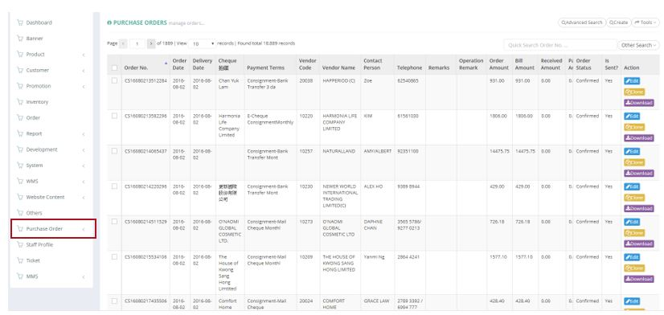
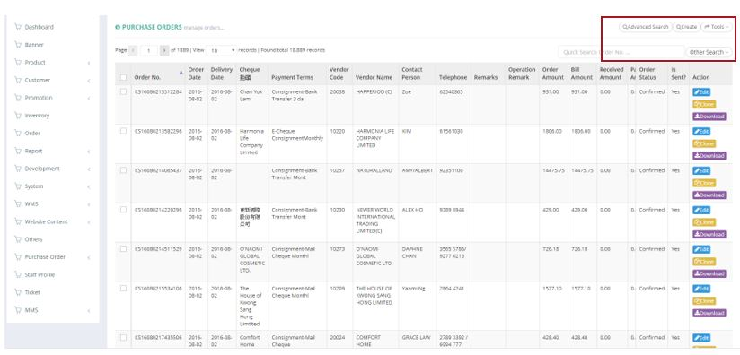
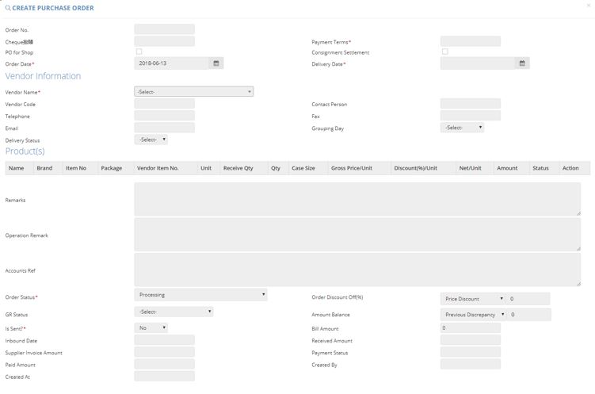
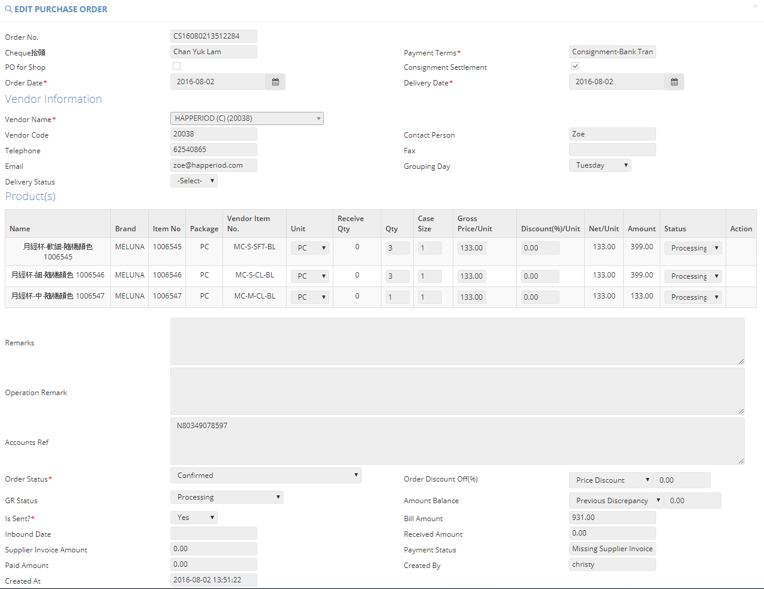

************
Purchase Order Module 
************
The Purchase Order displays the Purchase Orders made by our company to outside vendors. Users can use the “Advanced Search”, “Create” and “Tools” buttons to filter target orders, create purchase order items and export purchase order reports. With the buttons in the Action column users can also make changes or download the corresponding Order items.

|purorder|

.. list-table:: Purchase Order Module
    :widths: 10 50
    :header-rows: 1
    :stub-columns: 1

    * - FIELD NAME
      - FIELD DESCRIPTION
    * - Order No.
      - The Purchase Order ID
    * - Order Date
      - The Date of Purchase Order
    * - Delivery Date
      - The Date of Delivering the Purchase Order
    * - Cheque 抬頭
      - The Heading of Cheque settling the Order
    * - Payment Terms
      - The Payment Terms of Purchase Order
    * - Vendor Code
      - The Vendor Code of Purchase Order
    * - Vendor Name
      - The Vendor Name of Purchase Order
    * - Contact Person
      - The Contact Person of Vendor
    * - Telephone
      - The Telephone number of Vendor
    * - Remarks
      - The Additional Information of Purchase Order
    * - Operation Remark
      - The Additional Operation Information of Purchase Order
    * - Order Amount
      - The Order Amount of Purchase Order
    * - Bill Amount
      - The Bill Amount of Purchase Order
    * - Received Amount
      - The Received Amount of Purchase Order
    * - Paid Amount
      - The Paid Amount of Purchase Order
    * - Order Status
      - The Status of Order
    * - Is Sent?
      - "Yes" or "No" of whether the Order is sent
    * - Action
      - Edit, Clone or Download Purchase Order Item
      
Buttons
==================
The Buttons on top of The Table allow users to find The Target Purchase Order Items they are looking for, create new Purchase Order Items and export them out into a report.

|purorder_buttons|

.. list-table:: Purchase Order Module Buttons
    :widths: 10 50
    :header-rows: 1
    :stub-columns: 1

    * - FIELD NAME
      - FIELD DESCRIPTIONS
    * - Advanced Search
      - User can use multiple search criterion to locate the target Purchase Order item
    * - Create
      - User can create new Purchase Order Items.
    * - Tools
      - User can export different kinds of Purchase Order Reports.
    * - Other Search 
      - User can display all Purchase Orders or only all paid orders in the table
    * - Order No Input Box
      - User can input corresponding Purchase Order ID to locate Purchase Order
      
Advanced Search
==================
Users can input different criterion into the pop-up Advanced Search window to locate target Purchase Order Items.

|purorder_search|

.. list-table:: Purchase Order Module Advanced Search
    :widths: 10 50 50
    :header-rows: 1
    :stub-columns: 1

    * - FIELD NAME
      - FIELD DESCRIPTIONS
      - CALCULATION/ DROPDOWN LIST
    * - Order Date
      - The Date Range of Purchase Order
      -
    * - Delivery Date
      - The Date Range of Delivering the Purchase Order
      -
    * - Inbound Date
      - The Date Range of Inbounding the Purchase Order
      -
    * - Vendor Name 
      - The Vendor Name of Purchase Order
      -
    * - Payment Terms
      - The Payment Terms of Purchase Order
      -
    * - PO for Shop
      - Select if there is PO for Shop
      -
    * - Consignment Settlement
      - Select if there is Consignment Settlement
      -
    * - Exist Operation Remark?
      - Select if there is Existing Operation Remark
      -
    * - Created By
      - The Person who Created The Purchase Order
      -
    * - Is Sent?
      - Whether The Order is Sent
      -
    * - Order Status
      - The Order Status of The Purchase Order
      - " **Processing - The Purchase Order is cuurently under process;**
           **Submitted to Account - The Purchase Order is submitted to Account Department;**
          **Confirmed - The Purchase Order is confirmed by The Vendor;**
           **Paid & Unreceived - The Purchase Order is Paid but not yet Received;**
          **Received & Unpaid - The Purchase Order is Unpaid but already Received;**
           **Received & Unpaid & Variance - The Purchase Order is Unpaid and Received but Variance Exist with Received Quantities and Ordered Quantities**
          **Received & Paid & Variance -  The Purchase Order is Paid and Received but Variance Exist with Received Quantities and Ordered Quantities;**
           **Received & Paid & Merchandising Settled Variance - The Purchase Order is Paid and Received but Settled Variance Exist with Received Quantities and Ordered Quantities;**
          **Closed - The Purchase Order is completed;**
           **Void - The Purchase Order is Voided** "
    * - GR Status
      - Good Receive Status, use for workflow control
      - **Processing - The Purchase Order is currently under process;**
         **Confirmed - The Purchase Order is confirmed by The Vendor;**
        **Arrived - The Purchase Order has arrived the warehouse;**
         **Received - The Purchase Order is received by our staff;**
        **Received with Qty Variance - The Purchase Order is received and being confirmed on the quantity;**
         **Partial Received - The Purchase Order is only partially received by our staff**
    * - Order No(s)
      - The Order No.(s) of Orders to be Searched, 1 row 1 order no.
      - 

Create and Edit
==================
By clicking the “Create” Button on top of the Purchase Order table, users can create a new Purchase Order Item.
Users can also click the “Edit” Button of the corresponding Purchase Order Item under the Action column to edit the details of that item.

|purorder_create|

|purorder_edit|

