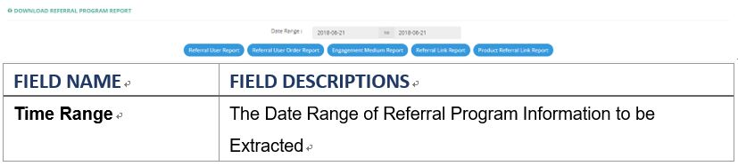
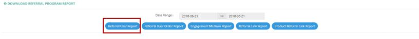
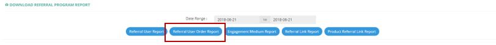

************
Referral Program Module
************
User can extract the details of different Referral Program from the Referral Program Module.

|ref|

.. list-table:: Referral Program
    :widths: 10 50
    :header-rows: 1
    :stub-columns: 1

    * - FIELD NAME
      - FIELD DESCRIPTIONS
    * - Time Range
      - The Date Range of Referral Program Information to be Extracted
      
Referral User Report
==================
User can Export the Details of Referral User by clicking on the “Referral User Report” button.

|ref_report|

.. list-table:: Referral User Report
    :widths: 10 50
    :header-rows: 1
    :stub-columns: 1

    * - FIELD NAME
      - FIELD DESCRIPTIONS
    * - Referral User SN
      - The Referral User Customer ID
    * - Referral User Email
      - The Referral User Customer Email
    * - No. of referral (By Unique Users)
      - The Number of Unique Users Referred by The User
    * - No. of referral (Total No.)
      - The Total Number of Unique Users Referred by The User
    * - No. of referral via Facebook
      - The Total Number of Unique Users Referred by The User via Facebook
    * - No. of referral via email
      - The Total Number of Unique Users Referred by The User via email
    * - No. of referral via WhatsApp
      - The Total Number of Unique Users Referred by The User via WhatsApp
    * - No. of referral via copy URL
      - The Total Number of Unique Users Referred by The User via copy URL
    * - No. of referred user register account
      - The Total Number of Unique Users Referred by The User via registered account
    * - Referral conversion rate
      - The Referral Conversion Rate of The Customer
    * - Total GMV amount of referred user
      - Total sales unit of the referred user
    * - Total billing amount of referred user
      - Total billing amount of the referred user
    * - Total discount
      - The Total Discount given to The Referral User Customer
    * - Total rebate amount
      - The Total Rebate Amount given to The Referral User Customer
    * - Score for Ranking
      - 
    * - Total No.of purchase
      - Number of orders made by referred users
    * - Avg idle period of referred users (day)
      - The Average Time Period in between every Orders by all Referred Users
    * - No. of referral of referred user
      - Number of users the referred user refers
    * - Phone No.
      - The Phone Number of The Referral User Customer
    * - Last Name
      - The Last Name of The Referral User Customer
    * - First Name
      - The First Name of The Referral User Customer
    * - Total GMV
      - Total sales unit
    * - No.of purchase
      - The Number of Purchase Order 
    * - Active User (Purchase within 90 days)
      - "Yes" or "No" Active Referral User Customer (who made purchase within last 90 days)
    * - Address
      - The Address of The Referral User Customer
    * - Address Distinction
      - Commercial/ Non-Commercial
    * - Company
      - The Company of The Referral User Customer
    * - Share rate on Mobile
      - The percentage to share on mobile platform
    * - Share rate on PC
      - The percentage to share on PC platform
    * - Share rate on Tablet
      - The percentage to share on Tablet platform
      
Referral User Order Report
==================
User can Export the Order Details made by Referred User in this Module.

|ref_report2|

.. list-table:: Referral User Order Report
    :widths: 10 50
    :header-rows: 1
    :stub-columns: 1

    * - FIELD NAME
      - FIELD DESCRIPTIONS
    * - Referral User SN
      - The Referral User Customer ID
    * - Referral User Email
      - The Referral User Customer Email
    * - Referred User SN
      - The Referral User Customer ID
    * - Referred User Email
      - The Referral User Customer Email
    * - Referred Medium
      - The Medium of Referral
    * - Referred Link
      - The Link of Referral
    * - Order SN after referral
      - The Order ID of The Referral
    * - Is referred order
      - Is The Order made by The Referred User
    * - Order Date
      - The Date of Referred Order
    * - Order Amount
      - The Order Amount of Referred Order
    * - Delivery Charge
      - The Delivery Charge of Referred Order
    * - Promotion
      - The Promotion Amount of Referred Order
    * - Z-Dollar Used
      - The Amount Z-Dollar Used of Referred Order
    * - Sales Amount
      - The Sales Amount of Referred Order
    * - Bill Amount
      - The Billing Amount of Referred Order
    * - Payment Type
      - The Payment Type of Referred Order
    * - Region
      - The Region of Referred Order
    * - District
      - The District of Referred Order
    * - Area
      - The Area of Referred Order

